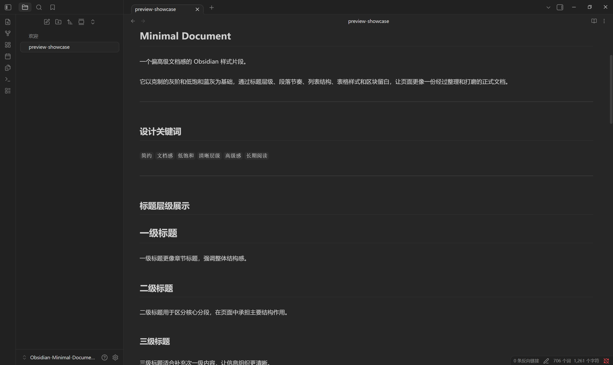
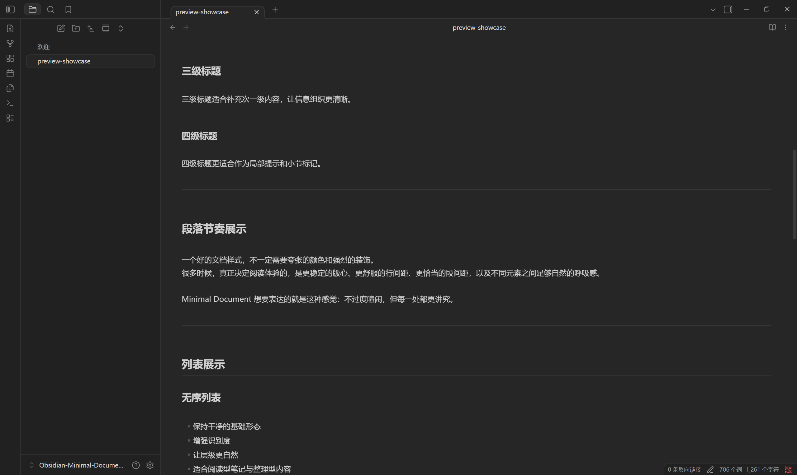
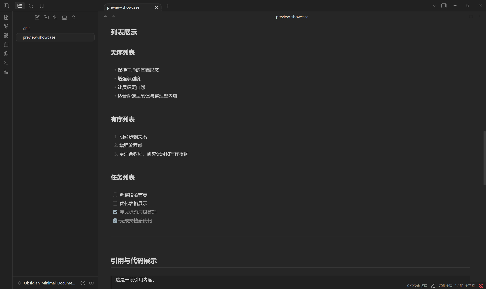
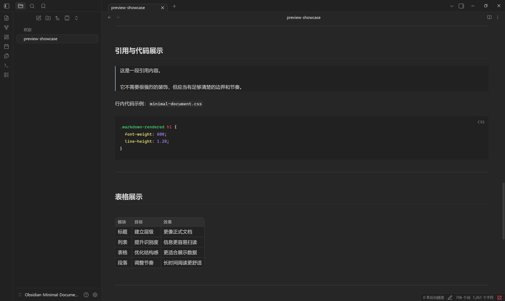
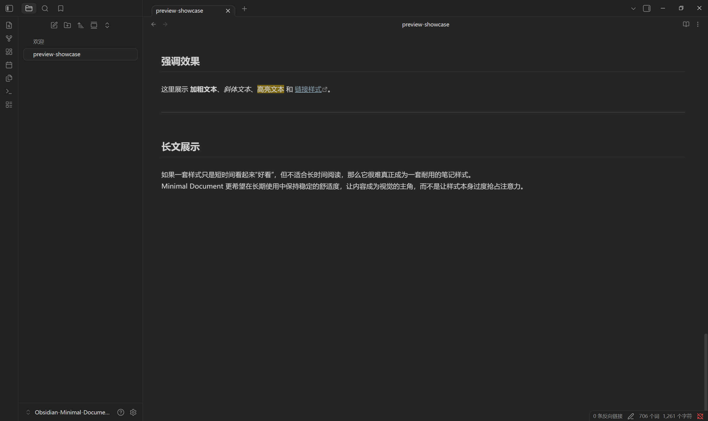
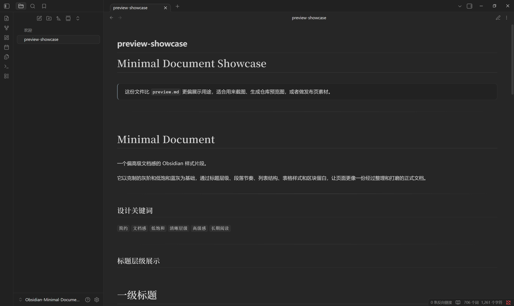
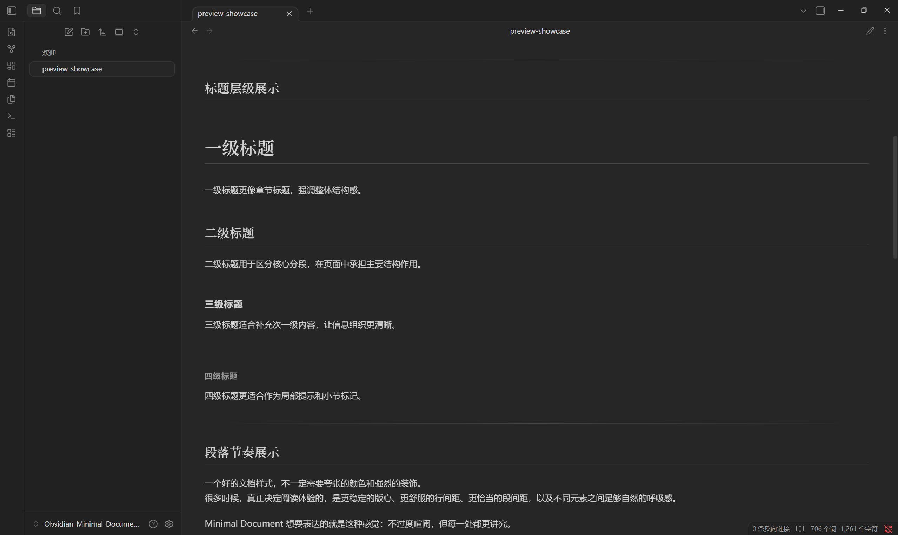
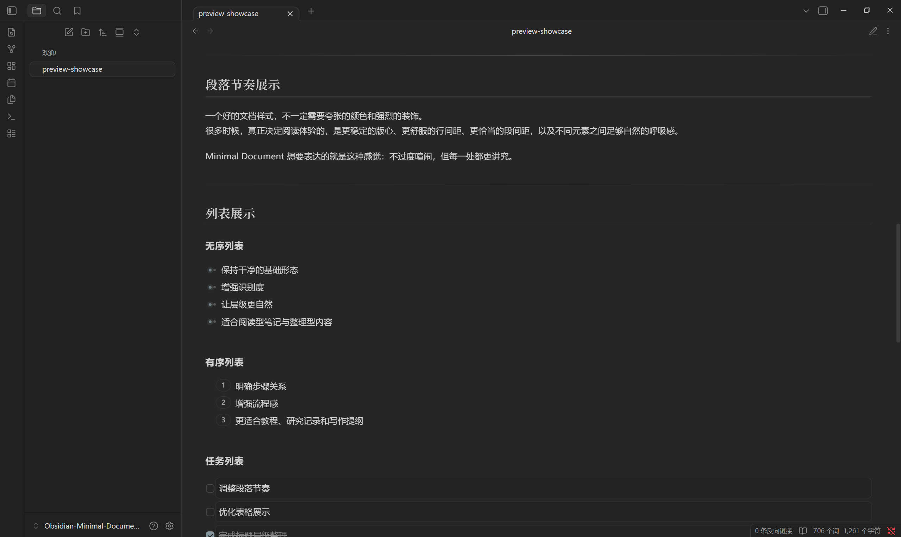
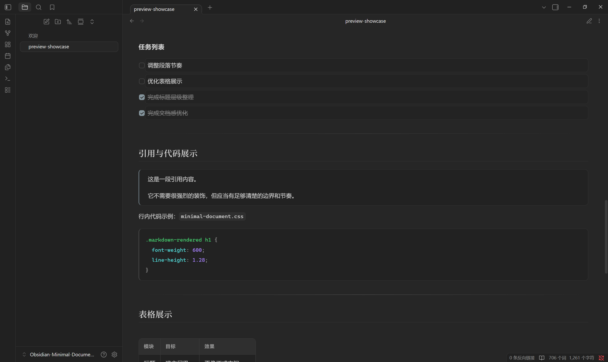
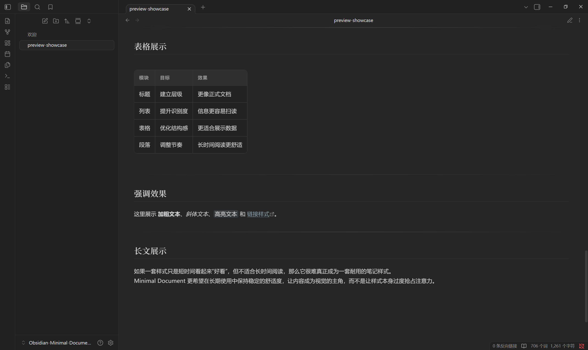

# Minimal Document

一个为 Obsidian 设计的 CSS Snippet。它借鉴 Minimal 的配色思路，以低饱和灰阶和克制的蓝灰色为基础，强化文档排版感、阅读节奏和视觉层级，让笔记看起来更像一份经过认真设计的高级文档。

> 为喜欢简约配色与精致排版的 Obsidian 用户准备的一套文档风格样式。

[English README](./README.en.md)

## 介绍

Minimal Document 是一个偏文档风格的 Obsidian 样式片段，强调克制、耐看和长期阅读体验。

它并不追求花哨的视觉效果，而是通过更讲究的留白、标题节奏、版心宽度、列表结构、表格层次和区块区分，让页面更像一份精心排版的正式文档。

整体风格延续了 Minimal 的灰阶气质，但在信息识别、阅读节奏和文档质感上做了更明显的强化。

## 风格关键词

`简约` `低饱和` `同色系` `高级文档感` `清晰层级` `长期阅读`

## 设计目标

- 保持简约、低饱和、同色系的整体视觉
- 延续 Minimal 风格的灰阶与蓝灰配色
- 提升标题、列表、表格、引用、代码块等元素的识别度
- 优化长文阅读和写作时的留白与节奏
- 让笔记更接近正式文档而不是组件化界面

## 主要特性

- 基于 Minimal 灵感的灰阶配色与克制 accent 色
- 更偏高级文档感的版心、留白和排版节奏
- 更清晰的标题层级与分段结构
- 更容易区分的无序列表、有序列表和任务列表
- 更精致的表格、引用块、Callout、代码块和行内代码样式
- 更统一的链接、标签、图片和嵌入块视觉
- 适合长期记录、整理、阅读与写作

## 适合场景

- 阅读笔记
- 文献笔记
- 研究记录
- 长文写作
- 知识整理型仓库
- 喜欢 Minimal 配色，但希望界面更有文档感的用户

## 效果预览

### 编辑模式







### 阅读模式







## 文件结构 / Project Structure

```text
.
├─ README.md
├─ LICENSE
└─ snippets/
   └─ minimal-document.css
```

## 安装方式 / Installation

1. 将 `snippets/minimal-document.css` 放入你的 Obsidian 仓库中的 `.obsidian/snippets/` 目录。
2. 打开 Obsidian。
3. 进入 `设置 -> 外观 -> CSS 代码片段`。
4. 启用 `minimal-document`。

## 使用说明 / Notes

- 推荐搭配 Obsidian 默认主题使用。
- 配色灵感来自 Minimal，但版式和元素风格经过了重新整理，更偏精致文档排版。
- 如果你偏好克制、干净、耐看的视觉效果，这套样式会比较合适。
- 如果后续你继续调整样式，建议优先保持配色克制，再微调留白、版心和层级，这样最容易保持整体气质。

## 仓库说明 / Repository Scope

这个仓库只保留与项目发布直接相关的文件：

- `README.md`
- `README.en.md`
- `preview.md`
- `preview-showcase.md`
- `assets/README.md`
- `assets/*.png`
- `LICENSE`
- `snippets/minimal-document.css`

其余 Obsidian 本地配置、插件、主题和工作区文件不作为项目内容上传。

## 预览文件

- [preview.md](./preview.md)：常规效果预览文档
- [preview-showcase.md](./preview-showcase.md)：更适合截图和仓库展示的样板文档
- [assets/README.md](./assets/README.md)：截图资源目录说明

## 许可证 / License

本项目采用 [MIT License](./LICENSE)。

## 关键词 / Keywords

`obsidian` `css-snippet` `minimal-theme` `markdown` `typography` `documentation` `note-taking`
